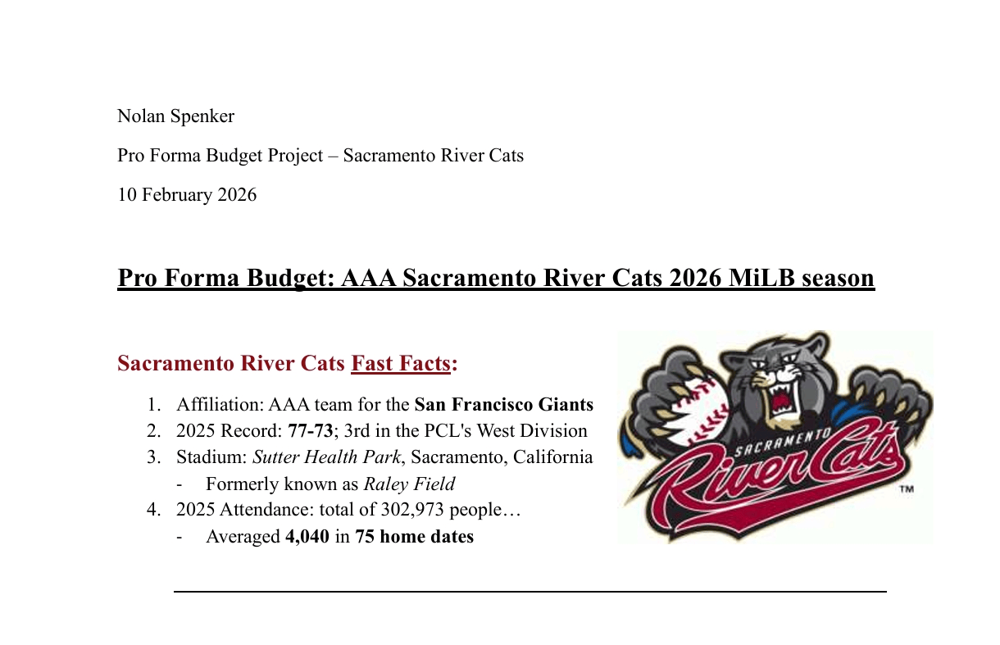
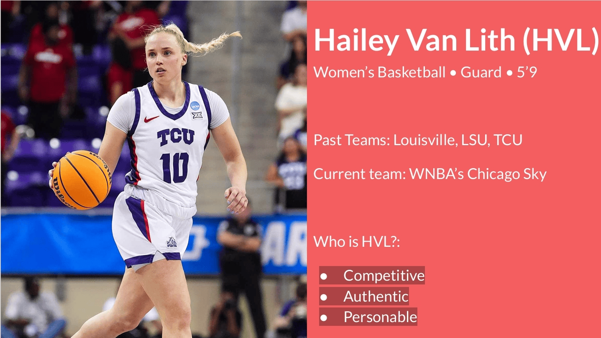

## 📌 <strong>About Me </strong> 

Born and raised in Roseville, California, I developed a strong passion for sports and data at an early age, with a particular interest in statistics, trends, and unique insights within the game. This interest ultimately led me to pursue a career in the sports analytics industry.

In the summer of 2023, I enrolled at the University of Oregon, where I am currently studying Sports Business and Economics. Maintaining strong academic standing, I am on track to graduate two quarters early in December 2026.

- 📍 Location: Eugene, Oregon
- 📫 Email: npspenker@gmail.com
- 🔗 LinkedIn: [Nolan Spenker](https://linkedin.com/in/nolan-spenker-210640355)

---

## 📄 <strong>Resume </strong>

[Download My Resume](resume.pdf)

---

## 🛠️ <strong>Skills Overview </strong>

### 💻 Technical Skills
- Python (pandas, numpy)
- Excel (financial modeling, forecasting, NPV analysis)
- Data Visualization (Tableau, Excel)
- Statistical Analysis (SPSS, regression analysis)

### 🧠 Practical Skills
- Data collection and real-time data entry (play-by-play sports data)
- Data-driven decision making and analysis
- Financial modeling and valuation
- Project management and team leadership
- Professional communication and presentation

### ⚽ Tactical / Sports Skills
- Sports analytics and performance tracking
- Play-by-play data analysis (football and basketball)
- Game flow, clock management, and possession analysis
- Knowledge of sports business operations and fan engagement

---

## 💼 <strong>Projects </strong> 

### 📈 Project 1: Sacramento River Cats Pro Forma Budget Project

- Developed a full pro forma financial model for a AAA Minor League Baseball team
- Forecasted revenue streams including ticket sales, sponsorships, concessions, and parking
- <strong>Key takeaway:</strong> Determined the organization would operate at a projected profit of ~$1.6M

🔗 [View Full Project](river_cats_pro_forma.pdf)

---

### 📈 Project 2: Athlete Marketing Project

- Conducted a social media and brand audit, analyzing audience demographics and engagement trends  
- Developed a targeted marketing strategy with partnership recommendations and activation campaigns  
- <strong>Key takeaway:</strong> Leveraged brand alignment to drive audience growth and engagement

🔗 [View Full Project](athlete_marketing_plan.pdf)

---  

### 📊 Project 3: MLB Analytic Project (SOON TO COME!)

- Analyze a dataset by scraping MLB Savant using Python and AI resources
- Create an anaytical question in baseball and statistically examined its impact on the league using SPSS and Excel
- <strong>Key Takeaway:</strong> Identified trends in X

<!-- [Project Preview](images/project1.png) -->

<!-- 🔗 [View Project](https://github.com/yourusername/project1) -->

---

## 📬 <strong>Contact </strong> 

Feel free to reach out!

- Email: npspenker@gmail.com
- LinkedIn: [Nolan Spenker](https://linkedin.com/in/nolan-spenker-210640355)
