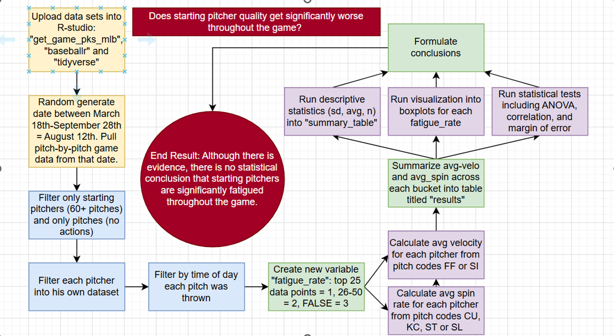
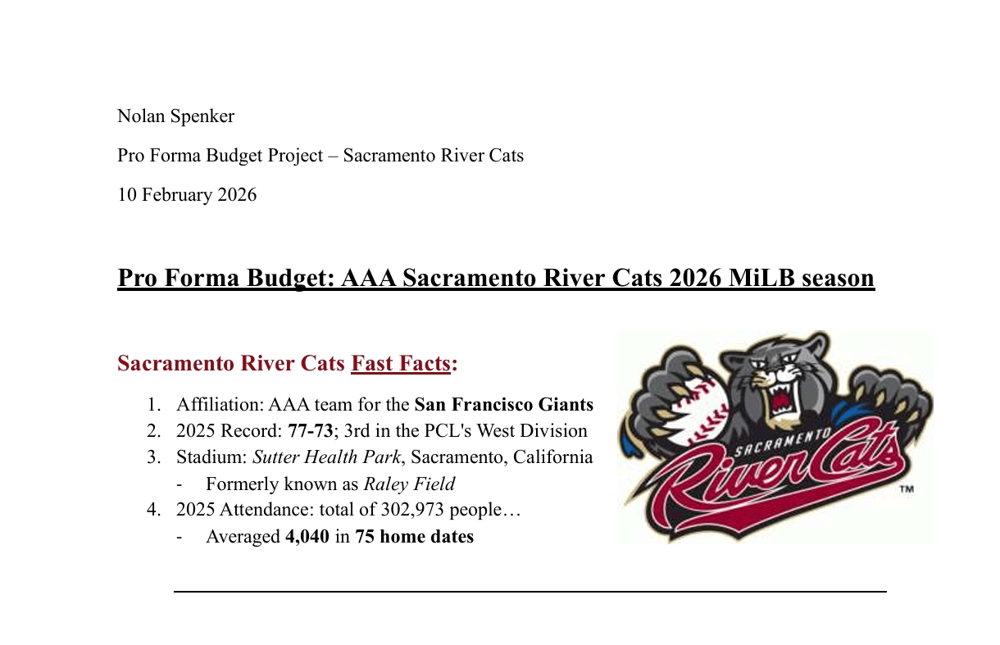
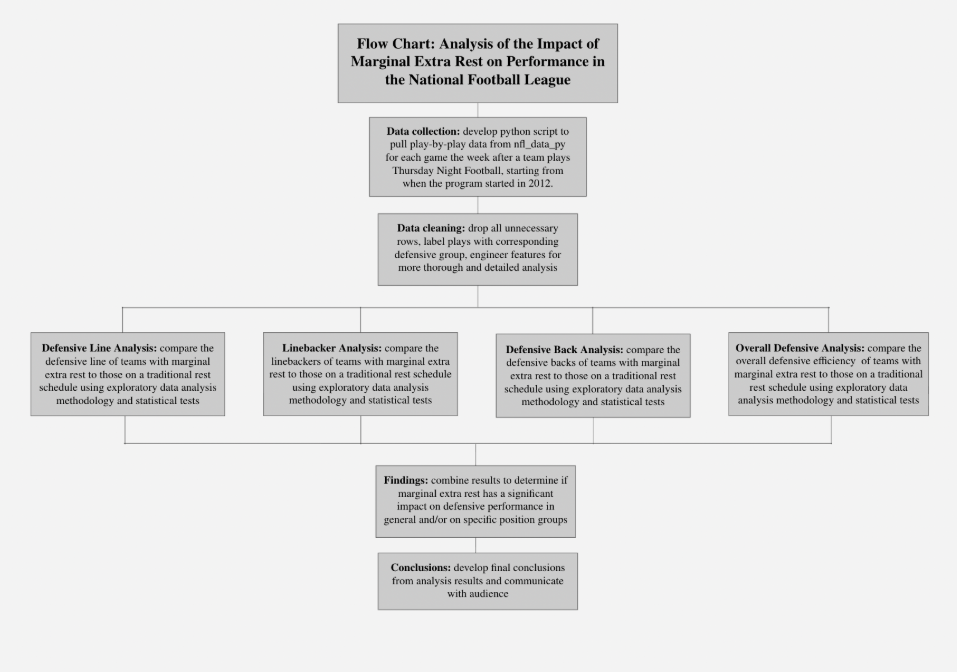

<link rel="preconnect" href="https://fonts.googleapis.com">
<link rel="preconnect" href="https://fonts.gstatic.com" crossorigin>

<link href="https://fonts.googleapis.com/css2?family=Inter:wght@400;500;600;700;750&display=swap" rel="stylesheet">

<link rel="stylesheet" href="css">
### Sports Business | Data Scouting | Sports Operations

I’m currently a Sports Business student at the University of Oregon and a data scout, where I combine my knowledge of sports with real-time data collection, attention to detail, and decision-making in fast-paced environments.

Previously, I spent more than ten years coaching, umpiring, and mentoring young athletes. Those experiences taught me how to evaluate performance, communicate effectively, lead operations, and understand the game beyond the numbers.

Looking ahead, my goal is to build a long-term career within a professional sports organization and grow into a high-ranking role where I can play a crucial part in evaluating information, shaping strategy, and making good decisions that positively impact the organization.

- Location: Eugene, Oregon
- Email: npspenker@gmail.com
- LinkedIn: [Nolan Spenker](https://linkedin.com/in/nolan-spenker-210640355)

---

## <strong>Resume </strong>

[Download My Resume](resume.pdf)

---

## <strong>Skills Overview </strong>

### Technical Skills
- Excel (financial modeling, forecasting, NPV analysis) 
- SPSS (statistical analysis, regression analysis) 
- Python (pandas, numpy) 
- R Studio (data visualization) 

### Practical Skills
- Data collection and real-time data entry 
- Data-driven decision making and analysis 
- Professional communication and presentation 
- Project management and team leadership 
- Financial modeling and valuation 

### Tactical / Sports Skills
- Sports analytics and performance tracking 
- Play-by-play data analysis 
- Game flow, clock management, and possession analysis 
- Knowledge of sports business operations and fan engagement 

---

## <strong>Projects </strong> 

### Project 1: MLB Statcast Pitching Performance Analysis

- Scraped and compiled pitch-by-pitch data from MLB Statcast (baseballr) using R-studio and AI-assisted tools
- Analyzed pitcher performance by breaking down physical metrics (e.g., spin rate and velocity) across an entire slate of games
- Created a new variable "fatigue_rate" which broke starting pitchers into categories of fatigue based on pitch count.
- <strong>Key Takeaway:</strong> No statistically significant decline in spin rate or velocity was observed over the course of the game, suggesting that starting pitchers are capable of maintaining effectiveness deep into outings.

- [View Full Project](Nolan Spenker.pdf)

---

### Project 2: Sacramento River Cats Pro Forma Budget 2026 Season

- Developed a full pro forma financial model for a AAA Minor League Baseball team
- Forecasted revenue streams including ticket sales, sponsorships, concessions, and parking
- <strong>Key takeaway:</strong> Determined the organization would operate at a projected profit of ~$1.6M

- [View Full Project](river_cats_pro_forma.pdf)

---

### Project 3: Impact of Marginal Extra Rest on NFL Defensive Performance

- Analyzed 50,000+ NFL play-by-play observations (2012–2024) to evaluate how additional recovery time after Thursday Night Football impacts defensive performance
- Built a data pipeline in Python, R, and Excel to calculate rest differentials, engineer defensive metrics, and perform regression and correlation analysis across position groups. 
- <strong>Key takeaway:</strong> Found that extra rest produced statistically significant but minimal defensive benefits, increasing defensive EPA by approximately 0.007 per play, while defensive line pressure rates remained effective even on short rest.

- [View Full Project](Operating Business Analytics_ Rest Days.pdf)

---  

## <strong>Contact </strong> 

Feel free to reach out!

- Email: npspenker@gmail.com
- LinkedIn: [Nolan Spenker](https://linkedin.com/in/nolan-spenker-210640355)
